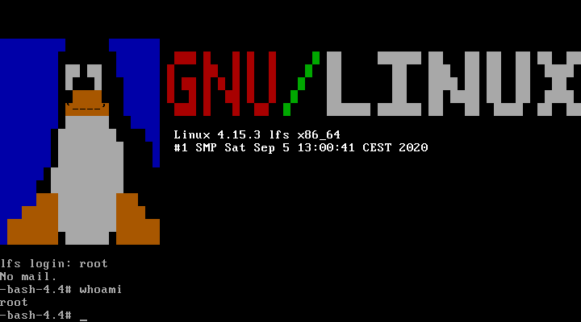

## Description

This repository contains docker configuration to build bootable iso
image with [Linux From Scratch 8.2](http://www.linuxfromscratch.org/lfs/downloads/8.2/LFS-BOOK-8.2.pdf).


## Status

At the moment, I don't have plans to update scripts to the latest LFS versions. However, pull requests are welcomed.

## Why

General idea is to learn Linux by building and running LFS system in
isolation from the host system.

## Structure

Scripts are organized in the way of following book structure whenever
it makes sense. Some deviations are done to make a bootable iso image.

## Build

Use the following command:

    docker rm lfs                                       && \
    docker build --tag lfs:8.2 .                        && \
    sudo docker run -it --privileged --name lfs lfs:8.2 && \
    sudo docker cp lfs:/tmp/lfs.iso .
    # Ramdisk you can find here: /tmp/ramdisk.img

Please note, that extended privileges are required by docker container
in order to execute some commands (e.g. mount).

## Usage

Final result is bootable iso image with LFS system which, for
example, can be used to load the system inside virtual machine (tested
with VirtualBox).

## Troubleshooting

If you have problems with master branch, please try to use stable version from the latest release with toolchain from archive.

## License

This work is based on instructions from [Linux from Scratch](http://www.linuxfromscratch.org/lfs)
project and provided with MIT license.

## Linux From Scratch Docker

[reinterpretcat/lfs](https://github.com/reinterpretcat/lfs)

```bash
libgmp.la: not found
libmpfr.la: not found
libmpc.la: not found
/mnt/lfs/sources /mnt/lfs/sources
Assume toolchain from host is already placed in sources folder
/mnt/lfs/sources
Building binutils..
Approximate build time: 1 SBU
Required disk space: 547 MB
tar: binutils-*.tar.xz: Cannot open: No such file or directory
tar: Error is not recoverable: exiting now
```

put to `lfs/toolchain`

[](https://udomain.dl.sourceforge.net/project/bzip2/bzip2-1.0.6.tar.gz)

```bash
/mnt/lfs/sources
Building bzip2..
Approximate build time: less than 0.1 SBU
Required disk space: 5.2 MBg
zip: stdin: not in gzip format
tar: Child returned status 1
tar: Error is not recoverable: exiting now
```

### bzip2 文件错误，重新下载

```bash
wget -c [https://udomain.dl.sourceforge.net/project/bzip2/bzip2-1.0.6.tar.gz](https://udomain.dl.sourceforge.net/project/bzip2/bzip2-1.0.6.tar.gz)
```

### syslinux

```bash
Start building bootable image..
/tmp /mnt/lfs/sources
Configuring syslinux..
tar: /mnt/lfs/sources/syslinux-*.tar.xz: Cannot open: No such file or directory
tar: Error is not recoverable: exiting now
```

[[syslinux] How to create a Bootable Live CD/DVD from your Linux From Scratch (LFS) build](https://www.syslinux.org/archives/2020-March/026620.html)

[reinterpretcat/lfs](https://github.com/reinterpretcat/lfs/blob/master/scripts/image/1.configure-syslinux.sh)

```bash
wget -c https://mirrors.edge.kernel.org/pub/linux/utils/boot/syslinux/syslinux-6.03.tar.xz
```
